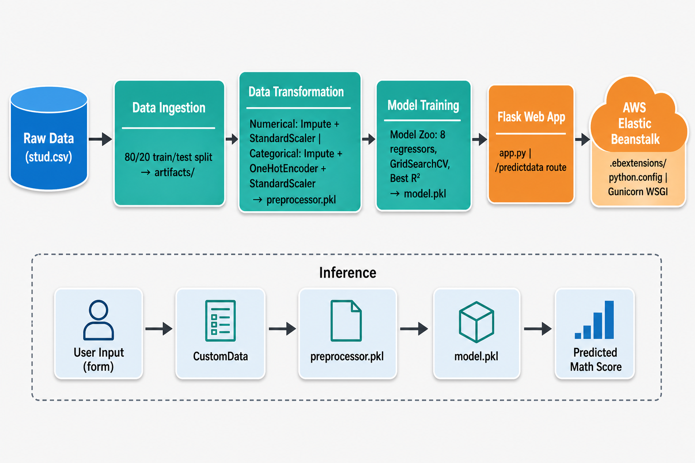

# Student Score Predictor — End-to-End ML Project

A production-ready machine learning application that predicts a student's **math score** based on demographic information and performance in reading and writing. The project covers the full ML lifecycle: exploratory data analysis, modular training pipeline, automated model selection, and a Flask web application deployed on **AWS Elastic Beanstalk**.



---

## Table of Contents

- [Problem Statement](#problem-statement)
- [Tech Stack](#tech-stack)
- [Project Structure](#project-structure)
- [Data Pipeline](#data-pipeline)
- [Model Training & Selection](#model-training--selection)
- [Inference Pipeline](#inference-pipeline)
- [Web Application](#web-application)
- [Deployment](#deployment)
- [Getting Started](#getting-started)

---

## Problem Statement

Given a student's background attributes — gender, race/ethnicity, parental education level, lunch type, test preparation status, and their reading and writing scores — predict their **math score** as a continuous value.

**Input Features**

| Feature | Type | Description |
|---|---|---|
| `gender` | Categorical | Student gender |
| `race_ethnicity` | Categorical | Race / ethnicity group |
| `parental_level_of_education` | Categorical | Highest education level of parents |
| `lunch` | Categorical | Standard or free/reduced lunch |
| `test_preparation_course` | Categorical | Completed or none |
| `reading_score` | Numerical | Score in reading (0–100) |
| `writing_score` | Numerical | Score in writing (0–100) |

**Target**

| Feature | Type | Description |
|---|---|---|
| `math_score` | Numerical | Score in math (0–100) |

---

## Tech Stack

| Layer | Libraries / Tools |
|---|---|
| Data & EDA | pandas, numpy, matplotlib, seaborn |
| Preprocessing | scikit-learn (Pipeline, ColumnTransformer, StandardScaler, OneHotEncoder) |
| Modelling | scikit-learn, XGBoost, CatBoost |
| Serialisation | dill |
| Web Framework | Flask |
| WSGI Server | Gunicorn |
| Deployment | AWS Elastic Beanstalk |
| Packaging | setuptools (`setup.py`) |

---

## Project Structure

```
mlproject/
├── .ebextensions/
│   └── python.config          # AWS Elastic Beanstalk WSGI config
├── artifacts/                 # Auto-generated training outputs
│   ├── data.csv               # Raw dataset copy
│   ├── train.csv              # Training split
│   ├── test.csv               # Test split
│   ├── preprocessor.pkl       # Fitted preprocessing pipeline
│   └── model.pkl              # Champion model
├── notebook/
│   ├── 1 . EDA STUDENT PERFORMANCE .ipynb   # Exploratory data analysis
│   ├── 2. MODEL TRAINING.ipynb              # Experimental model training
│   └── data/
│       └── stud.csv           # Raw source dataset
├── src/
│   ├── components/
│   │   ├── data_ingestion.py        # Reads data, creates train/test splits
│   │   ├── data_transformation.py  # Builds and saves preprocessor.pkl
│   │   └── model_trainer.py        # Trains model zoo, saves model.pkl
│   ├── pipeline/
│   │   └── predict_pipeline.py     # Loads artifacts, runs inference
│   ├── exception.py           # Custom exception handler
│   ├── logger.py              # Timestamped file logging
│   └── utils.py               # Shared helpers (save/load object, evaluate_models)
├── templates/
│   ├── index.html             # Landing page
│   └── home.html              # Prediction form & results
├── app.py                     # Flask entry point
├── requirements.txt
└── setup.py                   # Package setup (author: Srivalli)
```

---

## Data Pipeline

The pipeline is orchestrated through three modular components in `src/components/`. Running `data_ingestion.py` directly triggers all three stages in sequence.

### 1. Data Ingestion (`data_ingestion.py`)

- Reads the raw dataset from `notebook/data/stud.csv`.
- Saves a full copy to `artifacts/data.csv`.
- Performs an **80/20 stratified split** (random state 42) and persists `train.csv` and `test.csv` to `artifacts/`.

### 2. Data Transformation (`data_transformation.py`)

Builds a `ColumnTransformer` with two sub-pipelines:

| Pipeline | Columns | Steps |
|---|---|---|
| **Numerical** | `reading_score`, `writing_score` | Median imputation → `StandardScaler` |
| **Categorical** | `gender`, `race_ethnicity`, `parental_level_of_education`, `lunch`, `test_preparation_course` | Most-frequent imputation → `OneHotEncoder` → `StandardScaler` (no mean) |

The fitted transformer is serialised to `artifacts/preprocessor.pkl` via `dill`, ensuring the **exact same encoding and scaling** is applied at inference time.

### 3. Model Training (`model_trainer.py`)

See the next section.

---

## Model Training & Selection

`model_trainer.py` defines a **Model Zoo** of eight regressors. Each model is evaluated via `GridSearchCV` (cross-validated hyperparameter search implemented in `utils.evaluate_models`). The champion is chosen by highest **R² score** on the held-out test set.

| Model | Key Hyperparameter Search Space |
|---|---|
| Linear Regression | — |
| Decision Tree | criterion, max_depth, max_features, max_leaf_nodes |
| Random Forest | criterion, max_features, n_estimators |
| Gradient Boosting | loss, learning_rate, subsample, n_estimators |
| K-Neighbors Regressor | n_neighbors, weights, metric |
| XGBoost | learning_rate, n_estimators |
| CatBoost | depth, learning_rate, iterations |
| AdaBoost | learning_rate, n_estimators |

- If no model achieves R² ≥ 0.60, a `CustomException` is raised.
- The champion model is saved to `artifacts/model.pkl`.

---

## Inference Pipeline

`src/pipeline/predict_pipeline.py` provides two classes used by the Flask app:

- **`CustomData`** — accepts raw user inputs and converts them into a single-row `pandas.DataFrame` in the exact schema the preprocessor expects.
- **`PredictPipeline`** — loads `preprocessor.pkl` and `model.pkl` from `artifacts/`, applies the preprocessor transform, and returns the model's prediction.

This two-artifact design (separate preprocessor + model) keeps the feature engineering logic fully reproducible and decoupled from model selection.

---

## Web Application


`app.py` exposes two Flask routes:

| Route | Method | Description |
|---|---|---|
| `/` | GET | Renders the landing page (`index.html`) |
| `/predictdata` | GET | Renders the input form (`home.html`) |
| `/predictdata` | POST | Accepts form data, runs inference, returns predicted math score |

The predicted score is rounded to two decimal places and passed back to the same template for display.

---

## Deployment

The application is configured for **AWS Elastic Beanstalk** via `.ebextensions/python.config`:

```yaml
option_settings:
  aws:elasticbeanstalk:container:python:
    WSGIPath: app:app
```

This single configuration file tells Elastic Beanstalk to serve the application through the `app` object in `app.py`, using Gunicorn as the WSGI server. No infrastructure-as-code or container tooling is required — EB handles environment provisioning automatically.

---

## Getting Started

### Prerequisites

- Python 3.8+
- `pip`

### Installation

```bash
# Clone the repository
git clone <repo-url>
cd mlproject

# Install dependencies (also installs the src package in editable mode)
pip install -r requirements.txt
pip install -e .
```

### Train the Pipeline

```bash
python src/components/data_ingestion.py
```

This runs all three pipeline stages and writes `preprocessor.pkl` and `model.pkl` to `artifacts/`.

### Run the Web App Locally

```bash
python app.py
```

Navigate to `http://localhost:5000` in your browser, go to `/predictdata`, fill in the student details, and receive the predicted math score.

### Run on AWS Elastic Beanstalk

1. Install and configure the [EB CLI](https://docs.aws.amazon.com/elasticbeanstalk/latest/dg/eb-cli3.html).
2. Initialise and deploy:

```bash
eb init -p python-3.11 mlproject
eb create mlproject-env
eb deploy
```

The `.ebextensions/python.config` is picked up automatically, routing traffic through Gunicorn to the Flask app.

---

*Author: Srivalli · lsatya21@gmail.com*
